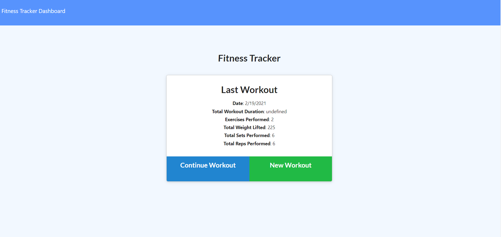
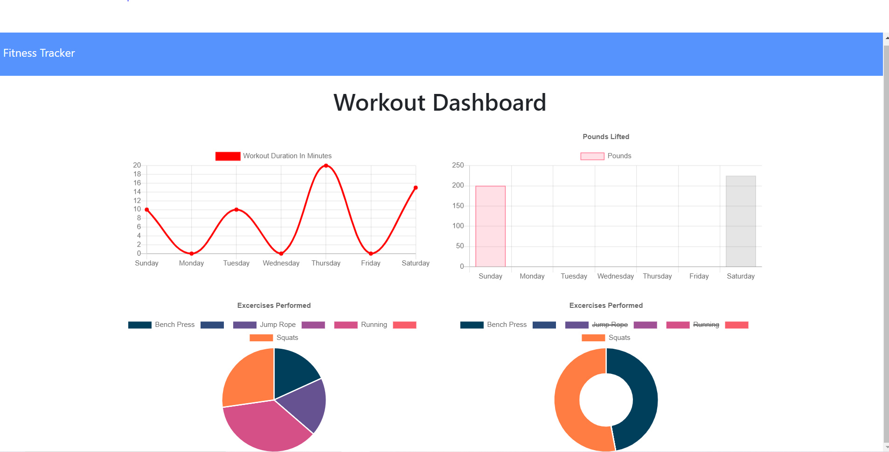

# Workout-Tracker

- The purpose of the workout tracker is to be able to log multiple exercises in a workout on any given day. User's can track the name, type, weight, sets, reps, and durations of their exercises. Let's get to work!

## Installation

- Run npm install in your terminal to launch this fitness based application to start tracking your exercises!

```bash
node i express
node i mongoose
node i morgan
```

## Usage

- While on the home page, you are presented with four options.

1. Latest Workout
   1. This page shows you your latest workout's date, duration, and exercises performed.
      
2. New Workout
   1. If you click on the new workout button, it will present you with an option of cardio or resistance.
3. Continue Workout
   1. After completing your workout, you can continue getting after it! If not, simply click the complete button to see your latest workout.
4. Dashboard
   1. The dashboard show yous a visual detailed graph of your workouts throughout the week!
      

## License

- Built under the MIT licence.

## Test

- No tests required.
